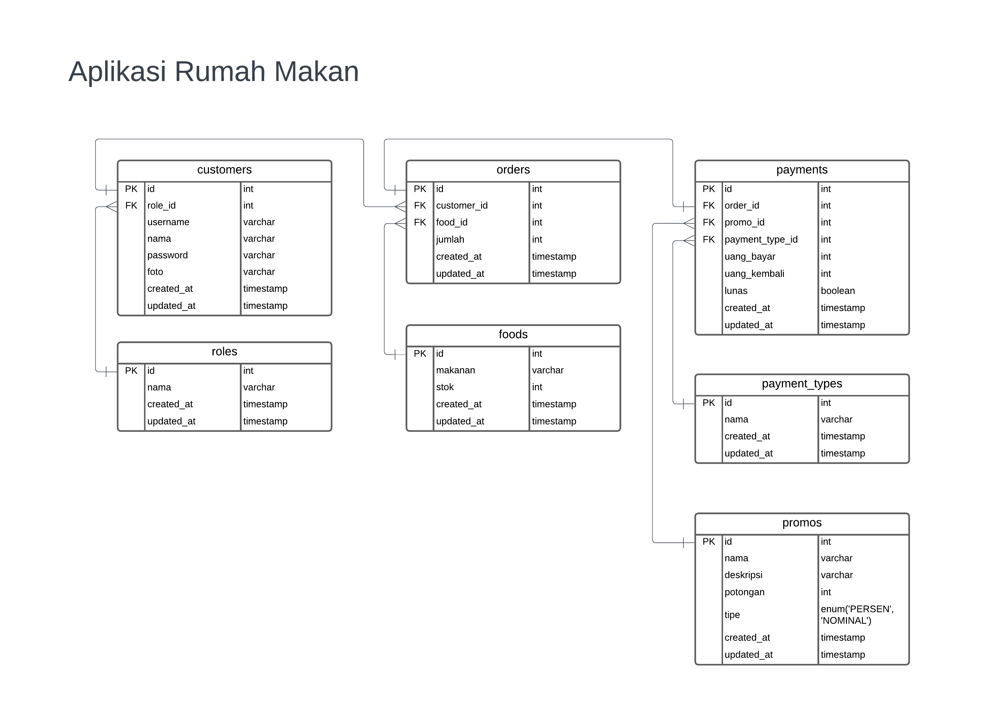

# Teori

## Soal

Rancangkanlah diagram database untuk aplikasi rumah makan.
Jelaskan teknologi yang akan dipakai untuk aplikasi ini dan mengapa anda memilih teknologi tersebut.
Kebutuhan:
1. Aplikasi ini bisa memasukkan pesanan-pesanan makanan pelanggan
2. Aplikasi ini bisa mengeluarkan struk pembelian
3. Aplikasi ini bisa mengeluarkan laporan penghasilan mingguan dan bulanan
4. Aplikasi ini bisa mengeluarkan laporan stok

Selain kebutuhan pokok diatas, silahkan tambahkan ide original anda untuk membuat aplikasi lebih baik.
(catatan: Soal ini tidak membutuhkan pengambil test untuk membuat aplikasi (coding).)

## Jawab

### Diagram database

Berikut adalah rancangan diagram database untuk aplikasi rumah makan tersebut:

  

### Teknologi yang akan dipakai

1. Docker container dengan golang didalamnya, sebagai container aplikasi (agar aplikasi mudah untuk dikemas dan di-deploy ke server, dengan asumsi bahwa server adalah suatu VM)
2. Nginx, sebagai webserver untuk reverse proxy ke container
3. MySQL, sebagai RDBMS (Relational Database Management System)
4. API Payment Gateway, untuk melakukan pembayaran dengan QRIS, e-wallet, dll

### Kebutuhan

#### 1. Aplikasi ini bisa memasukkan pesanan-pesanan makanan pelanggan

Bisa dilakukan dengan operasi CRUD ke database pada tabel orders, payments, dan foods

#### 2. Aplikasi ini bisa mengeluarkan struk pembelian

Bisa dilakukan dengan mengolah data pada tabel orders dan payments

#### 3. Aplikasi ini bisa mengeluarkan laporan penghasilan mingguan dan bulanan

Bisa dilakukan dengan mengolah data pada tabel payments menggunakan cara agregat (per bulan dan per minggu)

#### 4. Aplikasi ini bisa mengeluarkan laporan stok

Bisa dilakukan dengan mengolah data pada tabel foods

#### (FITUR TAMBAHAN) 5. Aplikasi bisa melakukan pembayaran menggunakan QRIS dan payment service lainnya

Bisa dilakukan dengan integrasi API call ke API Payment Gateway

#### (FITUR TAMBAHAN) 6. Aplikasi bisa memberikan promo pada pembayaran tertentu

Bisa dilakukan dengan menggunakan tabel promos, payments, customers, dan roles